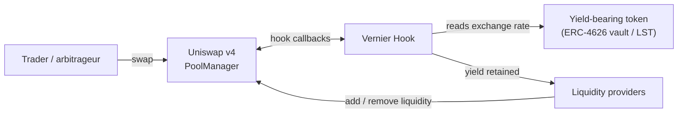
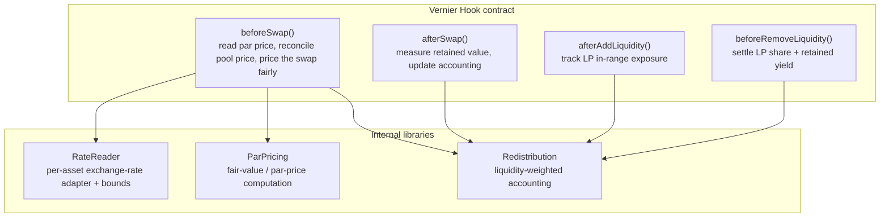
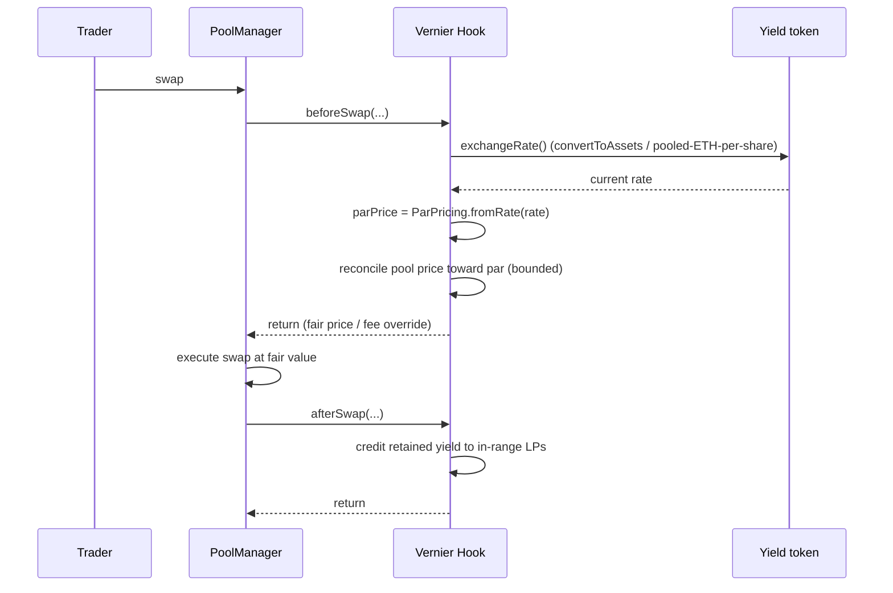

# Architecture

Vernier is a Uniswap v4 hook plus a small set of internal accounting libraries, deployed alongside curated pools for yield-bearing assets. Its core path has no off-chain components. Everything needed to price a swap against fair value and retain the yield for LPs happens synchronously inside the swap lifecycle.

## 1. System context



The only external contract Vernier reads is the yield-bearing token itself, for its on-chain exchange rate. There is no price oracle, relayer, or keeper in the path.

## 2. Component view



| Component | Responsibility |
|---|---|
| `beforeSwap` | Read the token's par price, reconcile it against the pool price, and ensure the swap executes at fair value so no accrued yield is left to arbitrage. |
| `afterSwap` | Record value retained for LPs and update accounting. |
| `afterAddLiquidity` | Track each LP's in-range liquidity for exposure-weighted payouts. |
| `beforeRemoveLiquidity` | Settle an LP's accrued share on exit. |
| `RateReader` | Per-asset adapter that returns the correct exchange rate (`convertToAssets` for ERC-4626, pooled-ETH-per-share for stETH) with per-asset safety bounds. |
| `ParPricing` | Turns an exchange rate into the pool's fair price and the reconciliation needed. |
| `Redistribution` | Reward-per-liquidity accumulator. |

The `RateReader` adapter pattern is deliberate: onboarding a new yield asset means writing one small adapter, which keeps the core hook asset-agnostic and is part of the venue's moat.

## 3. Swap-time data flow



## 4. Reward accounting

Vernier uses a reward-per-liquidity accumulator so payouts are O(1) per swap and per LP:

```
On retaining value V with total in-range liquidity L:
    rewardPerLiquidity += V / L

Each LP tracks:
    owed = liquidity x (rewardPerLiquidity - rewardPerLiquidityPaid[LP])

On remove / claim:
    pay owed, then set rewardPerLiquidityPaid[LP] = rewardPerLiquidity
```

## 5. Trust and dependencies

| Dependency | Vernier uses it? |
|---|---|
| External price oracle | No |
| Off-chain auction / relayer | No |
| Trusted keeper / bot | No |
| Governance for live prices | No |
| Yield token's own on-chain rate | Yes (canonical source of truth) |
| Curated asset onboarding | Yes (adapter + bounds per asset) |

## 6. Non-goals

- Vernier is not a permissionless listing venue for arbitrary tokens. It is a curated venue for vetted yield-bearing assets, which is safer and is part of the moat.
- Vernier does not try to predict market prices. It only reads the deterministic accrual a yield token publishes about itself.
- Vernier does not depend on any single chain feature beyond running as a v4 hook; it targets Unichain first for its liquidity and low fees.
