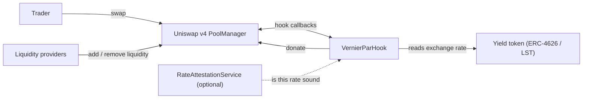
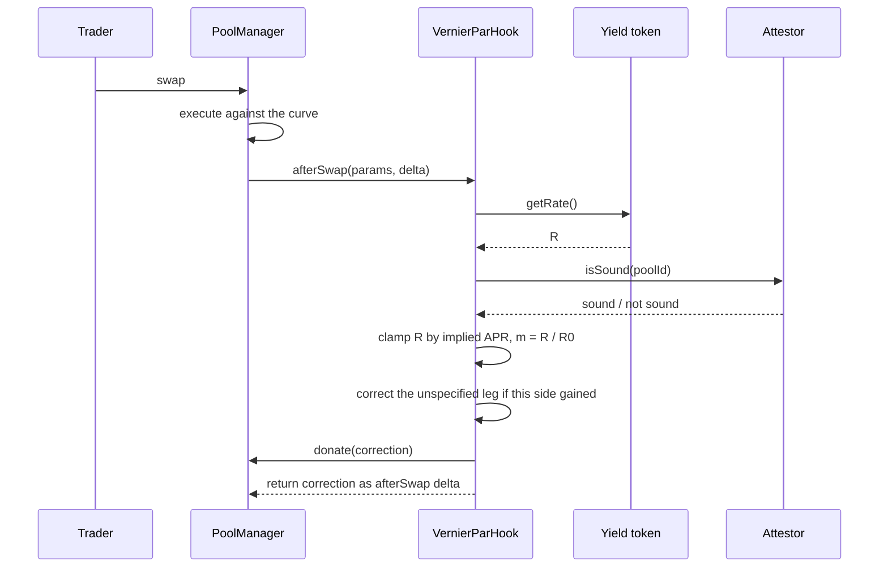

# Architecture

Vernier is a Uniswap v4 hook, a pair of rate adapters, and an optional operator set. The
pricing path is entirely on-chain and synchronous: everything needed to correct a swap for
published accrual happens inside the swap that triggers it.

## 1. System context

The only contract Vernier must read to price a swap is the yield token itself. There is no
price feed, relayer, or keeper in the path. The operator set is optional and can only
withhold a correction, never produce a price.

## 2. Contracts

| Path | Role |
|---|---|
| `src/VernierParHook.sol` | The hook. Reads the rate, corrects the unspecified leg, settles to LPs. |
| `src/interfaces/IRateSource.sol` | One method, `getRate()`, returning the token's own exchange rate. |
| `src/adapters/ERC4626RateSource.sol` | `convertToAssets(1e18)` for vault shares. |
| `src/adapters/StETHRateSource.sol` | `getPooledEthByShares(1e18)` for stETH. |
| `src/interfaces/IRateAttestor.sol` | One method, `isSound(poolId)`. The only thing an operator set may say. |
| `src/avs/RateAttestationService.sol` | Weighted ECDSA operator set implementing that interface. |
| `src/lib/Retention.sol` | Accumulator used only on the fallback path, when `donate` cannot pay. |
| `src/periphery/VernierSwapRouter.sol` | Minimal swap router used by the demo and scripts. |
| `src/VernierHook.sol` | The earlier gap-fee design, kept as the measurement baseline. |

Adding an asset class means writing one adapter. The hook itself stays asset-agnostic.

## 3. Hook permissions

`VernierParHook` takes four callbacks and no more.

| Callback | Why |
|---|---|
| `afterSwap` | Both swap legs are known here. In `beforeSwap` the output does not exist yet, so the exact-output case cannot be corrected at all. |
| `afterSwapReturnDelta` | Lets the hook take the correction out of the settled swap. |
| `afterAddLiquidity` | Records position liquidity for the fallback accumulator. |
| `beforeRemoveLiquidity` | Settles a position in the accumulator before it shrinks. |

The hook deliberately does not use `beforeSwapReturnDelta`. Nothing about the correction
needs to happen before the swap, and taking a delta there would add a settlement path with
no benefit.

## 4. Swap-time flow

If the attestor says the rate is not sound, the hook returns a zero delta and the pool
behaves as an ordinary AMM for that swap.

## 5. Settlement

The correction is returned as the `afterSwap` delta, which credits it to the hook, and is
then settled with `poolManager.donate` so v4 distributes it across in-range liquidity.
Returning a delta without settling it reverts the swap, so these two steps belong
together.

`donate` reverts when no liquidity is in range, which happens when a swap pushes the price
outside every position. The hook catches that, takes custody instead, and records the
amount against positions in `Retention` for LPs to `claim`. That accumulator is therefore
a fallback, not the main path.

## 6. Position attribution

v4 reports the address that called `modifyLiquidity`, which for any periphery router is
the router rather than the LP. Left alone, every LP behind a router collapses into a
single position.

Routers marked with `setTrustedRouter` may name the real owner in `hookData`. Anyone else
is taken at face value, so an untrusted caller cannot attribute liquidity to someone else's
position.

## 7. Trust surface

| Dependency | Used |
|---|---|
| External price feed | No |
| Off-chain auction or relayer | No |
| Keeper or bot in the pricing path | No |
| Governance setting live prices | No |
| Yield token's own on-chain rate | Yes, this is the price input |
| Operator set | Optional, and may only withhold a correction |
| Owner | Yes, for pool configuration and router trust |

The owner can configure pools, set the attestor, and mark routers trusted. It cannot move
a price or take LP funds. Pool configuration is owner-gated because an unconfigured pool
reverts every swap, so an open setter would let anyone brick a pool or pin it to a hostile
rate source.

## 8. Non-goals

- Not a permissionless listing venue. Each asset is onboarded with an adapter and bounds.
- Not a price predictor. It reads accrual the token publishes about itself and nothing else.
- Not a replacement for price discovery. Deviation from par stays on the curve on purpose.
